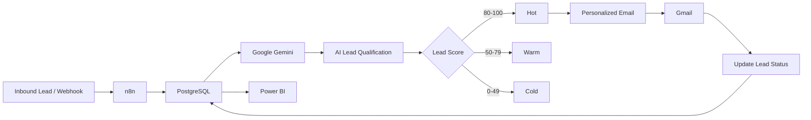
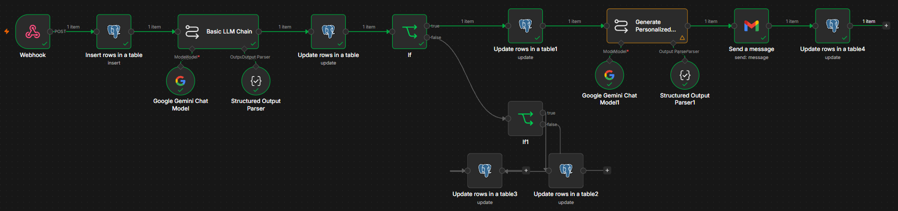
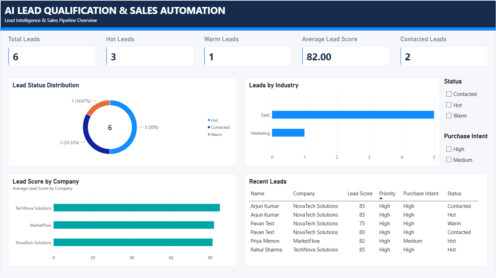

# AI Lead Qualification & Sales Automation

An end-to-end AI-powered lead qualification and sales automation system that captures inbound leads, evaluates them using an LLM, assigns lead scores and priorities, routes leads based on qualification, generates personalized sales emails, and tracks the sales pipeline through PostgreSQL and Power BI.

## Project Overview

The system automates the initial lead qualification process that is commonly handled manually by sales teams.

A lead enters through a webhook and is processed through an n8n workflow. The lead is stored in PostgreSQL, analyzed using Google Gemini, assigned a lead score and priority, and routed into Hot, Warm, or Cold categories.

For qualified leads, the system generates a personalized sales email and sends it through Gmail. The lead status is then updated in PostgreSQL.

Power BI connects to the PostgreSQL database to provide an interactive sales intelligence dashboard.

## Architecture



## Screenshots

### n8n Automation Workflow



### Power BI Dashboard



## Key Features

- Webhook-based lead ingestion
- Automated lead data storage
- AI-powered lead qualification
- Lead scoring from 0–100
- Purchase intent classification
- Priority classification
- Hot / Warm / Cold lead routing
- AI-generated lead summaries
- AI-generated personalized sales emails
- Automated Gmail outreach
- Lead contact status tracking
- PostgreSQL data persistence
- Interactive Power BI dashboard

## AI Lead Qualification

Google Gemini evaluates each lead using information such as:

- Business need
- Pain points
- Purchase intent
- Company size
- Urgency
- Potential business value

The model produces structured output containing:

- Lead Score
- Priority
- Purchase Intent
- Pain Points
- Recommended Action
- AI Summary

## Lead Routing

| Lead Score | Classification |
| ------------ | ---------------- |
| 80–100 | Hot |
| 50–79 | Warm |
| 0–49 | Cold |

## Automation Workflow

The n8n workflow performs the following steps:

1. Receive lead through webhook
2. Insert lead into PostgreSQL
3. Analyze lead using Google Gemini
4. Store AI qualification results
5. Route lead based on lead score
6. Generate personalized sales email
7. Send email through Gmail
8. Update lead status to Contacted

The complete n8n workflow is available in:
n8n/ai-lead-qualification.json

## Power BI Dashboard

The Power BI dashboard provides a sales pipeline overview including:

- Total Leads
- Hot Leads
- Warm Leads
- Average Lead Score
- Contacted Leads
- Lead Status Distribution
- Leads by Industry
- Lead Score by Company
- Recent Leads
- Status filtering
- Purchase Intent filtering

Dashboard file:
Dashboard/dashboard.pbix

## Database

PostgreSQL is used as the persistent data layer.
The database schema is available in:
database/init.sql

Main fields include:

- Lead information
- AI qualification results
- Lead score
- Priority
- Purchase intent
- Pain points
- Recommended action
- AI summary
- Lead status
- Email sent timestamp
- Created and updated timestamps

## Technologies

| Technology | Purpose |
| ------------ | --------- |
| n8n | Workflow automation |
| Google Gemini | AI lead qualification and email generation |
| PostgreSQL | Lead data storage |
| Gmail | Automated sales outreach |
| Power BI | Sales analytics and visualization |
| Docker | Local containerized deployment |
| SQL | Database schema and data operations |

## Project Structure

AI-Lead-Automation/
│
├── Dashboard/
│   └── dashboard.pbix
│
├── database/
│   └── init.sql
│
├── n8n/
│   └── ai-lead-qualification.json
│
├── .env.example
├── .gitignore
├── docker-compose.yml
└── README.md

## Local Setup

Prerequisites
Install:

- Docker Desktop
- Git
- Power BI Desktop

### 1. Clone the repository

```bash
git clone [YOUR-REPOSITORY-URL](https://github.com/PavanRV7/AI-Lead-Automation.git)
cd AI-Lead-Automation
```

### 2. Configure environment variables

Create a local .env file based on .env.example.
Never commit .env or API keys to GitHub.

### 3. Start Docker services

docker compose up -d

This starts:

- PostgreSQL
- n8n

### 4. Open n8n

Open:
<http://localhost:5678>

Import the workflow from:

n8n/ai-lead-qualification.json

Configure the required n8n credentials for:

- PostgreSQL
- Google Gemini
- Gmail

### 5. Database

The PostgreSQL database is configured through Docker Compose.
The schema can be created using:
database/init.sql

### 6. Power BI

Open:
Dashboard/dashboard.pbix

## Example Lead Flow

Inbound Lead
     ↓
Webhook
     ↓
PostgreSQL
     ↓
Gemini AI Analysis
     ↓
Lead Score = 85
Priority = High
Purchase Intent = High
     ↓
Hot Lead
     ↓
Personalized Email
     ↓
Gmail
     ↓
Status = Contacted

## Project Outcome

The project demonstrates how AI, workflow automation, databases, email automation, and business intelligence can be combined into an end-to-end sales automation pipeline.
It reduces manual lead qualification effort and provides sales teams with structured lead intelligence and automated follow-up.

Author
Pavan R V
